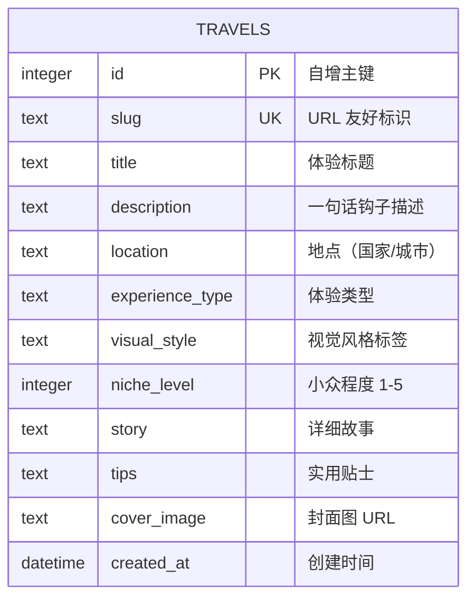

# 数据模型 ER 图

## 概述

本文档描述「100种不可思议旅行」内容展示平台 MVP 阶段的数据模型关系。

MVP 阶段采用单表设计（`travels`），以极简架构支撑核心内容展示需求。

## ER 图

## 字段说明

| 字段 | 类型 | 约束 | 说明 |
|---|---|---|---|
| id | INTEGER | PK, AUTOINCREMENT | 主键 |
| slug | TEXT | UNIQUE, NOT NULL | SEO 友好标识 |
| title | TEXT | NOT NULL | 体验标题 |
| description | TEXT | - | 列表卡片展示用简短描述 |
| location | TEXT | NOT NULL | 地点信息 |
| experience_type | TEXT | NOT NULL | 体验类型分类 |
| visual_style | TEXT | - | 视觉风格标签 |
| niche_level | INTEGER | NOT NULL, CHECK(1-5) | 小众程度评级 |
| story | TEXT | - | 详情页长文故事 |
| tips | TEXT | - | 实用旅行贴士 |
| cover_image | TEXT | - | 封面图片 URL |
| created_at | DATETIME | DEFAULT CURRENT_TIMESTAMP | 创建时间 |

## 设计决策

### 为什么采用单表设计？

MVP 阶段核心需求是「内容展示」，以读操作为主，单表设计具有以下优势：

1. **查询简单**：无需 JOIN 操作，列表页和详情页均为单表查询，性能最优
2. **部署极简**：SQLite 单文件即可运行，无数据库配置成本
3. **开发快速**：减少 ORM 映射和关联查询的复杂度

### 扩展路径

当平台进入成长期，可按以下路径演进：

- **tags 表**：解耦体验类型和视觉风格为多对多标签系统
- **locations 表**：独立地点信息，支持地图可视化
- **users 表**：用户收藏、点赞等交互功能
- **media 表**：支持多图/视频内容管理
